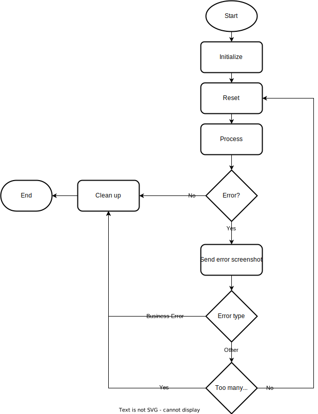
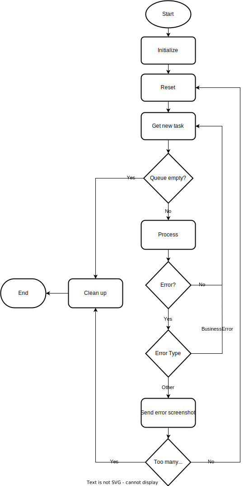

# Henstillinger Automation Robot (Aarhus Kommune)

This automation robot retrieves, processes, and synchronizes enforcement notices ("Henstillinger") from the **PEZ system** used by Aarhus Kommune. It communicates directly with the **PEZ REST API**, processes relevant enforcement cases, performs validation and enrichment (such as CVR lookup and geolocation correction), and maintains a dataset in **Azure Cosmos DB**.

The robot runs within the **OpenOrchestrator** framework and is designed for unattended automation.

---

## 🧩 Features

* Secure authentication against the **PEZ REST API**
* Fast retrieval of enforcement cases using paginated REST endpoints
* Detailed case inspection including violations, location, and owner data
* CVR-based company name enrichment using `cvrapi.dk`
* Automatic geolocation correction using OpenStreetMap (Nominatim) if coordinates are too close to the workplace
* Conditional database update logic to protect already processed invoices
* Cosmos DB synchronization with upsert logic
* Built-in caching of company lookups to minimize external API calls

---

## 🏗️ Tech Stack

* **Python 3.10+**
* **Requests** (for REST API communication)
* **Azure Cosmos DB SDK**
* **cvrapi.dk** (for company name lookup)
* **OpenStreetMap Nominatim API** (for geolocation correction)
* **OpenOrchestrator** (for secure secrets and configuration management)

---

## 🔧 Setup

### Prerequisites

Ensure the following are installed:

* Python 3.10+
* Python packages:

```bash
pip install requests azure-cosmos regex
```

### OpenOrchestrator Configuration

The robot expects the following credentials to be configured in **OpenOrchestrator**:

| Credential Name | Purpose                                                           |
| --------------- | ----------------------------------------------------------------- |
| `PEZUI`         | Username and password used to authenticate against the PEZ system |
| `AAKTilsynDB`   | Azure Cosmos DB endpoint and key                                  |

---

## 🚀 Usage

The `process()` function is the robot's main entry point.

It performs the following workflow:

1. Authenticates against the **PEZ API** using OAuth
2. Fetches enforcement cases (`PARKING_TICKET`) from the PEZ system using paginated REST requests
3. Retrieves detailed information for each case
4. Fetches the vehicle owner information
5. Filters violations to only those that are billable
6. Validates CVR numbers
7. Enriches company names when necessary
8. Corrects suspicious coordinates based on proximity to the depot
9. Inserts or updates records in **Cosmos DB**

Example usage:

```python
from robot_module import process
process(orchestrator_connection)
```

---

## 🧠 Business Logic Highlights

### FakturaStatus Skipping Logic

Rows are skipped from update **if**:

```python
FakturaStatus is not None and FakturaStatus != "Ny"
```

This ensures finalized invoices or those beyond `"Ny"` status remain untouched.

---

### Violation Filtering

Only specific violation types are eligible for invoicing. These are identified by codes such as:

```
1B., 2B., 3B., 4B., 5B., 7B., 8B., 9B., 10B., 12B., 19B., 23B.
```

Each case can contain **up to three violations**, and only valid ones are processed.

---

### Coordinate Correction

If the location coordinates are within **100 meters of the depot**, they are considered unreliable and replaced by coordinates derived via **OpenStreetMap geocoding** using the street address.

---

### CVR Validation

The robot performs:

* Format validation (8 digits)
* **Modulus-11 validation**

Only valid company CVR numbers are accepted.

---

## 📂 Database Structure (Cosmos DB Container: `henstillinger`)

Each violation becomes its own document.

| Field             | Description                                     |
| ----------------- | ----------------------------------------------- |
| `id`              | Unique identifier (`HenstillingId_ForseelseNr`) |
| `HenstillingId`   | Enforcement case number                         |
| `ForseelseNr`     | Violation number (1–3)                          |
| `Forseelse`       | Violation description                           |
| `CVR`             | Company registration number                     |
| `FirmaNavn`       | Company name                                    |
| `Adresse`         | Street and house number                         |
| `Latitude`        | Coordinates (corrected if necessary)            |
| `Longitude`       | Coordinates (corrected if necessary)            |
| `Startdato`       | Start date of enforcement                       |
| `Slutdato`        | End date                                        |
| `Kvadratmeter`    | Area value (if set later)                       |
| `Tilladelsestype` | Billing type                                    |
| `FakturaStatus`   | Defaults to `"Ny"`                              |

---

## 🌐 External APIs

* **PEZ API** – internal Aarhus Kommune enforcement system
* [CVR API](https://cvrapi.dk/)
* [OpenStreetMap Nominatim](https://nominatim.org/release-docs/develop/api/Search/)

---

## 📌 Notes

* CVR lookups are cached to minimize external API requests.
* Geolocation correction ensures reliable coordinates for enforcement cases.
* Existing records with locked statuses are never modified.
* Designed for unattended execution via **OpenOrchestrator**.


# Robot-Framework V3

This repo is meant to be used as a template for robots made for [OpenOrchestrator](https://github.com/itk-dev-rpa/OpenOrchestrator).

## Quick start

1. To use this template simply use this repo as a template (see [Creating a repository from a template](https://docs.github.com/en/repositories/creating-and-managing-repositories/creating-a-repository-from-a-template)).
__Don't__ include all branches.

2. Go to `robot_framework/__main__.py` and choose between the linear framework or queue based framework.

3. Implement all functions in the files:
    * `robot_framework/initialize.py`
    * `robot_framework/reset.py`
    * `robot_framework/process.py`

4. Change `config.py` to your needs.

5. Fill out the dependencies in the `pyproject.toml` file with all packages needed by the robot.

6. Feel free to add more files as needed. Remember that any additional python files must
be located in the folder `robot_framework` or a subfolder of it.

When the robot is run from OpenOrchestrator the `main.py` file is run which results
in the following:
1. The working directory is changed to where `main.py` is located.
2. A virtual environment is automatically setup with the required packages.
3. The framework is called passing on all arguments needed by [OpenOrchestrator](https://github.com/itk-dev-rpa/OpenOrchestrator).

## Requirements
Minimum python version 3.10

## Flow

This framework contains two different flows: A linear and a queue based.
You should only ever use one at a time. You choose which one by going into `robot_framework/__main__.py`
and uncommenting the framework you want. They are both disabled by default and an error will be
raised to remind you if you don't choose.

### Linear Flow

The linear framework is used when a robot is just going from A to Z without fetching jobs from an
OpenOrchestrator queue.
The flow of the linear framework is sketched up in the following illustration:



### Queue Flow

The queue framework is used when the robot is doing multiple bite-sized tasks defined in an
OpenOrchestrator queue.
The flow of the queue framework is sketched up in the following illustration:



## Linting and Github Actions

This template is also setup with flake8 and pylint linting in Github Actions.
This workflow will trigger whenever you push your code to Github.
The workflow is defined under `.github/workflows/Linting.yml`.

