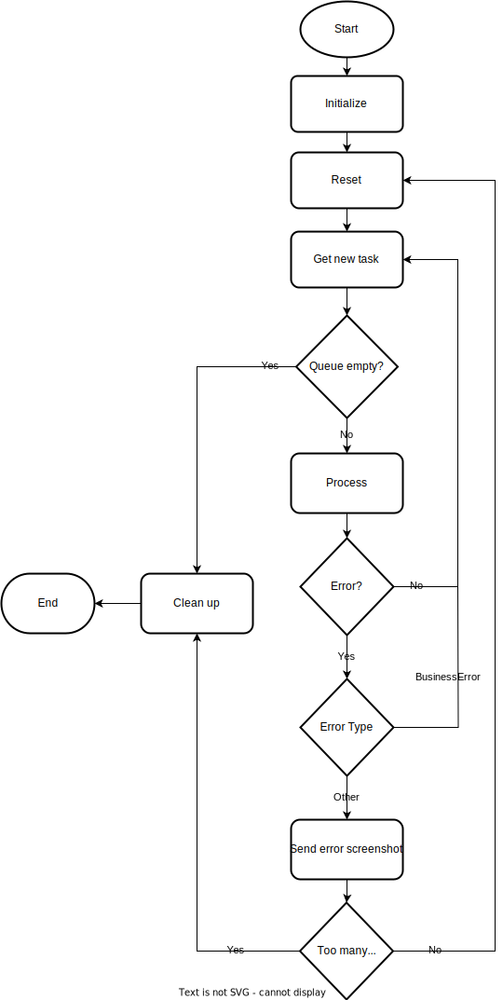

# 🚦 Henstillinger Automation Robot (Aarhus Kommune)

This automation robot is designed to download, process, and update enforcement notices ("Henstillinger") from the Mobility Workspace system of Aarhus Kommune. It integrates with Azure SQL, fetches new or updated data via Selenium, performs CVR lookups, and maintains a local dataset in the `VejmanKassen` table.

## 🧩 Features

* Headless login and CSV export from Aarhus Mobility Workspace
* Automatic download detection
* CVR-based company name enrichment using `cvrapi.dk`
* Conditional database update logic for enforcement cases
* Geolocation correction using OpenStreetMap (Nominatim) if coordinates are too close to the workplace.
* Built-in safeguards to prevent overwriting finalized invoices (`FakturaStatus`)

---

## 🏗️ Tech Stack

* **Python 3.10+**
* **Selenium** (for headless browser automation)
* **pyodbc** (for SQL Server database interaction)
* **cvrapi.dk** (for company name lookup)
* **OpenStreetMap Nominatim API** (for geolocation correction)
* **OpenOrchestrator** (for secure secrets and configuration management)

---

## 🔧 Setup

### Prerequisites

Ensure the following are installed:

* Chrome Browser
* ChromeDriver (match your Chrome version)
* ODBC Driver 17 for SQL Server
* Python packages:

  ```bash
  pip install selenium pyodbc requests regex
  ```


## 🚀 Usage

The `process()` function is the robot's main entry point. It:

1. Logs in to Mobility Workspace
2. Navigates to the *Henstillinger* tab and sets a date filter
3. Downloads the resulting CSV
4. Parses and processes each row
5. Updates or inserts data into `dbo.VejmanKassen`
6. Optionally fetches missing company names via CVR API
7. Corrects suspicious coordinates based on proximity to the depot

```python
from robot_module import process
process(orchestrator_connection)
```

---

## 🧠 Business Logic Highlights

### FakturaStatus Skipping Logic

Rows are skipped from update **if**:

```python
FakturaStatus is not None and FakturaStatus != "Ny"
```

This ensures finalized invoices or those beyond "Ny" status are left untouched.

---

### Coordinate Correction

If the location is too close to the depot (less than 100 meters), coordinates are re-derived via OpenStreetMap geocoding based on street address.

---

## 📂 Output Table Structure (`[dbo].[VejmanKassen]`)

| Column          | Notes                             |
| --------------- | --------------------------------- |
| `HenstillingId` | Unique case identifier            |
| `CVR`           | Company registration number       |
| `FirmaNavn`     | Resolved via CVR lookup           |
| `Startdato`     | Start date of enforcement         |
| `Slutdato`      | End date                          |
| `Adresse`       | Resolved street + house number    |
| `Forseelse`     | Description of violation          |
| `Longitude`     | Geolocation (corrected if needed) |
| `Latitude`      | Geolocation (corrected if needed) |
| `FakturaStatus` | Defaults to `"Ny"` if inserted    |

---

## 🌐 External APIs

* [CVR API](https://cvrapi.dk/)
* [OpenStreetMap Nominatim](https://nominatim.org/release-docs/develop/api/Search/)

---

## 📌 Notes

* Geolocation and CVR lookups have built-in fallback and logging for resilience.
* All downloaded CSVs are deleted after processing.
* The robot runs headlessly and can be integrated into unattended automation flows.

---


# Robot-Framework V3

This repo is meant to be used as a template for robots made for [OpenOrchestrator](https://github.com/itk-dev-rpa/OpenOrchestrator).

## Quick start

1. To use this template simply use this repo as a template (see [Creating a repository from a template](https://docs.github.com/en/repositories/creating-and-managing-repositories/creating-a-repository-from-a-template)).
__Don't__ include all branches.

2. Go to `robot_framework/__main__.py` and choose between the linear framework or queue based framework.

3. Implement all functions in the files:
    * `robot_framework/initialize.py`
    * `robot_framework/reset.py`
    * `robot_framework/process.py`

4. Change `config.py` to your needs.

5. Fill out the dependencies in the `pyproject.toml` file with all packages needed by the robot.

6. Feel free to add more files as needed. Remember that any additional python files must
be located in the folder `robot_framework` or a subfolder of it.

When the robot is run from OpenOrchestrator the `main.py` file is run which results
in the following:
1. The working directory is changed to where `main.py` is located.
2. A virtual environment is automatically setup with the required packages.
3. The framework is called passing on all arguments needed by [OpenOrchestrator](https://github.com/itk-dev-rpa/OpenOrchestrator).

## Requirements
Minimum python version 3.10

## Flow

This framework contains two different flows: A linear and a queue based.
You should only ever use one at a time. You choose which one by going into `robot_framework/__main__.py`
and uncommenting the framework you want. They are both disabled by default and an error will be
raised to remind you if you don't choose.

### Linear Flow

The linear framework is used when a robot is just going from A to Z without fetching jobs from an
OpenOrchestrator queue.
The flow of the linear framework is sketched up in the following illustration:


### Queue Flow

The queue framework is used when the robot is doing multiple bite-sized tasks defined in an
OpenOrchestrator queue.
The flow of the queue framework is sketched up in the following illustration:



## Linting and Github Actions

This template is also setup with flake8 and pylint linting in Github Actions.
This workflow will trigger whenever you push your code to Github.
The workflow is defined under `.github/workflows/Linting.yml`.

